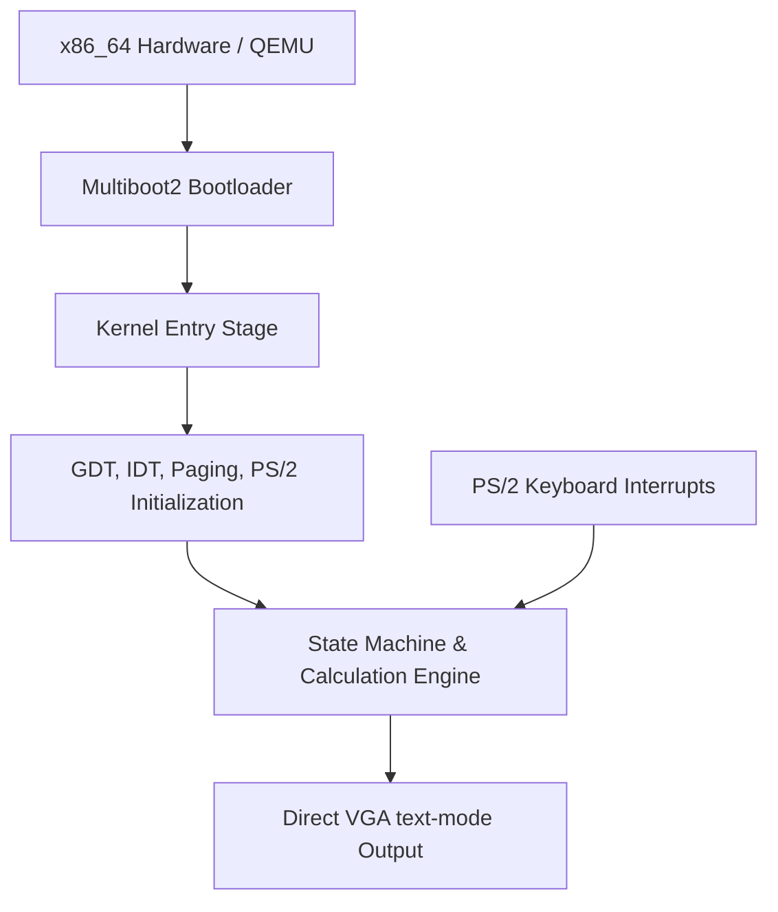

# Bare Metal Calculator: System Architecture

This document describes the high-level system architecture of the Bare Metal Calculator.

## System Overview

The Bare Metal Calculator is designed to run directly on x86_64 hardware (or emulation via QEMU) without an underlying operating system. It operates in 64-bit Long Mode, managing its own page tables, hardware interrupts, VGA text-mode display buffer, and PS/2 keyboard input.

## Core Subsystems

### 1. Boot & Low-Level Initialization
- **Multiboot2 Header**: Entry point compatible with GRUB / QEMU `-kernel`.
- **GDT (Global Descriptor Table)**: Configures segment selectors for 64-bit flat memory model.
- **IDT (Interrupt Descriptor Table)**: Sets up exception handlers and hardware interrupt routes (specifically keyboard IRQ 1 via PIC remap).
- **Paging**: Sets up identity mapping for the first 2MB or 1GB of physical memory using 4-level page tables.

### 2. State Machine & Execution Engine
- **State Struct**: The entire state of the calculator fits within a single cache line (64 bytes), aligned to prevent false sharing and cache line splits.
- **No-Heap Policy**: Absolutely zero dynamic memory allocation (`malloc`/`free`) is allowed in the kernel. Everything is pre-allocated statically or on the stack.
- **Fixed-Point Engine**: Fixed-point arithmetic is used to avoid floating-point non-determinism, using a high-precision layout representation.

### 3. I/O Drivers
- **VGA Console Driver**: Direct writes to `0xB8000` memory-mapped I/O. Supports custom fonts, colors, and direct screen mapping.
- **PS/2 Keyboard Driver**: Interrupt-driven scancode reading via `0x60` and `0x64` I/O ports. Remapped PIC translates scancodes to calculator input characters.

## Control Flow

1. **Boot**: The QEMU / GRUB loader loads the ELF kernel, sets up initial segment registers, and jumps to `_start`.
2. **Setup**: Kernel initializes the screen, installs GDT/IDT, unmasks keyboard interrupts, and enables CPU interrupts (`sti`).
3. **Event Loop**: The CPU halts (`hlt`) in a loop, waking up on keyboard interrupts to process scancodes, update state, and trigger rendering.
